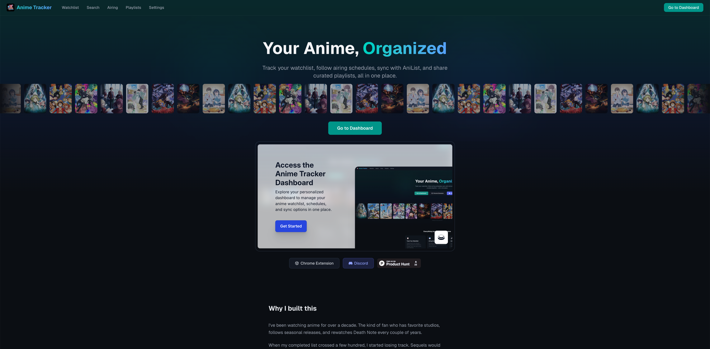

# Anime Tracker

Track your anime watchlist and get notified when new episodes drop. Available as a Chrome extension and a web app.



## Features

### Web App ([animetracker.lol](https://animetracker.lol))

- Watchlist with episode-level tracking (list and card views)
- Anime search with multi-provider fallback (AniList, Jikan, Kitsu)
- Weekly airing schedule (Mon-Sun grid)
- Smart recommendation engine with taste profiling
- Franchise watch order (BFS traversal)
- Buddy system with friend recommendations
- Shareable playlists and public profiles
- AniList OAuth and Kitsu watchlist import
- Notification feed (episodes, sequels, buddy requests, achievements)
- SFW/NSFW toggle

### Chrome Extension ([Web Store](https://chromewebstore.google.com/detail/anime-tracker/biidimfpepakgljgokmoiljgakehbhod))

- Search and add anime to your watchlist
- Episode tracking with click-to-toggle grid
- Background polling with native OS notifications
- Notification feed as default view

## Quick Start

### Web App

```bash
cd web
cp .env.local.example .env.local  # fill in Supabase keys
npm install
npm run dev
```

### Chrome Extension

1. Copy `ext/lib/config.example.js` to `ext/lib/config.js` and fill in values
2. Open `chrome://extensions`, enable Developer Mode
3. Click "Load unpacked" and select the `ext/` folder

See [docs/getting-started.md](docs/getting-started.md) for the full setup guide.

## Monorepo Structure

```
anime-tracker/
  ext/          # Chrome Extension (Manifest V3, vanilla JS)
  web/          # Web App (Next.js, TypeScript, Tailwind, Supabase)
  functions/    # Netlify scheduled/background functions
  docs/         # Contributor documentation
  scripts/      # Admin scripts (gitignored)
```

## Documentation

| Guide | Description |
|-------|-------------|
| [Getting Started](docs/getting-started.md) | Setup instructions for both web app and extension |
| [Architecture](docs/architecture.md) | System overview, data flow, deployment |
| [Web App](docs/web-app.md) | Routes, components, lib modules, styling |
| [Extension](docs/extension.md) | Manifest V3, service worker, storage |
| [Database](docs/database.md) | Supabase schema, RLS policies, RPCs |
| [Providers](docs/providers.md) | Multi-provider fallback, caching, pagination |

## Contributing

We welcome contributions! See [CONTRIBUTING.md](CONTRIBUTING.md) for the workflow, code style, and PR process.

## Tech Stack

- **Web**: Next.js, TypeScript, Tailwind CSS v4, Supabase
- **Extension**: Vanilla JS, Manifest V3, ES modules
- **Data**: AniList GraphQL API (primary), Jikan/MAL and Kitsu (fallbacks)
- **Hosting**: Netlify (web + functions), Chrome Web Store (extension)

## License

MIT
